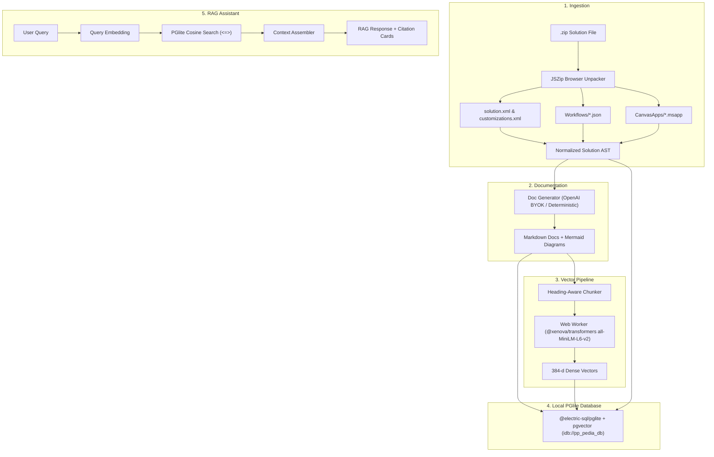

# pp-pedia: Power Platform Documentation & RAG Assistant

**pp-pedia** is an intelligent, client-side documentation generator and retrieval-augmented generation (RAG) assistant for Microsoft Power Platform solutions.

All processing, parsing, documentation generation, vector embeddings, and database queries run **100% in your browser** without uploading your solution archives to any remote servers.

---

## 🌟 Key Features

1. **Zero-Server Client-Side Ingestion**:
   - Directly unzips and parses Power Platform `.zip` solution packages in the browser using `JSZip`.
   - Extracts `solution.xml` (metadata, publisher, components), `customizations.xml` (Dataverse tables, columns, relationships, cascade rules, OptionSets, SiteMap), Cloud Flows (`Workflows/*.json`), Canvas Apps (`CanvasApps/*.msapp`), and Environment Variables (`environmentvariabledefinitions.json`).
   - Normalizes everything into a strongly-typed `SolutionAST`.

2. **In-Browser PGlite Database with `pgvector`**:
   - Uses `@electric-sql/pglite` and `@electric-sql/pglite-pgvector` backed by IndexedDB (`idb://pp_pedia_db`).
   - Stores solutions, markdown documents, and 384-dimensional dense vector embeddings locally.
   - Re-hydrates previous sessions immediately on page reload.

3. **In-Browser Vector Embeddings (Web Worker)**:
   - Uses `@xenova/transformers` (`Xenova/all-MiniLM-L6-v2`) inside a dedicated Web Worker to produce 384-d normalized dense embeddings with zero API costs.
   - Chunks markdown semantically by heading hierarchy (`#`, `##`, `###`), preserving document context breadcrumbs.

4. **Interactive Documentation Reader**:
   - Renders GitHub-flavored Markdown with live interactive **Mermaid diagrams** (ERDs for Dataverse, Flowcharts for Power Automate Cloud Flows, navigation flows for Canvas Apps).
   - Features diagram zoom, reset, raw code inspection, and copy controls.

5. **Context-Aware RAG Assistant**:
   - Real-time vector similarity retrieval (`<=>` cosine distance in PGlite).
   - Search across a specific solution or all ingested solutions (cross-project).
   - Clickable **Source Citation Cards** showing document title, section heading, similarity score, and excerpt.
   - Clicking any citation immediately jumps to that section in the documentation reader.

6. **BYOK (Bring Your Own Key) & Offline Mode**:
   - Supports OpenAI API keys with customizable base URLs (Azure OpenAI, Ollama, OpenRouter, LocalAI) and model selection (`gpt-4o-mini`, `gpt-4o`, etc.).
   - Built-in deterministic generator allows full documentation generation, Mermaid diagrams, and RAG retrieval even with no API key or offline!

7. **Multi-Format Export**:
   - **ZIP Bundle**: Organized markdown hierarchy (`README.md`, `overview.md`, `dataverse/schema.md`, `flows/*.md`, `canvas-apps/*.md`, `metadata.json`).
   - **Consolidated Markdown**: Single complete documentation handbook with Table of Contents.
   - **Raw AST JSON**: Download normalized schema metadata for tooling integration.

---

## 🚀 Getting Started

### Prerequisites
- Node.js v18+ (tested with v22)
- npm or pnpm

### Installation

```bash
# Clone the repository
git clone https://github.com/sagarpandey88/pp-pedia.git
cd pp-pedia

# Install client dependencies
cd client
npm install
cd ..
```

### Running the Development Server

```bash
# From the repository root:
npm run dev

# Or directly in client:
cd client && npm run dev
```

Open your browser at `http://localhost:5173`.

### Running Verification Tests

```bash
npm test
```

### Building for Production

```bash
npm run build
```

The production assets will be output to `client/dist`.

### Deploying to GitHub Pages

An automated GitHub Actions workflow is pre-configured at [`.github/workflows/deploy.yml`](.github/workflows/deploy.yml).

To enable deployment:
1. In your GitHub repository, navigate to **Settings** > **Pages**.
2. Under **Build and deployment** > **Source**, choose **GitHub Actions**.
3. Push changes to the `main` branch (or run the workflow manually via the **Actions** tab).
4. Your application will be live at `https://<username>.github.io/pp-pedia/`.

---

## 🏗️ Architecture & Data Flow



---

## 📄 License
Apache-2.0
