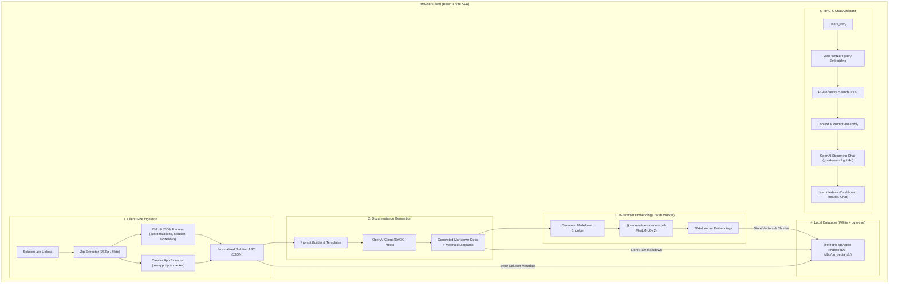

# Power Platform Project Documentation & RAG Assistant (pp-pedia)
## Architecture & Technical Design Document

This document outlines the full architecture, data flow, component design, database schema, and implementation plan for **pp-pedia**, an intelligent client-side documentation generator and RAG assistant for Microsoft Power Platform solutions.

---

## 1. System Overview & Core Objectives

1. **Client-Side Artifact Extraction**: Unpack Power Platform `.zip` solution files directly in the browser without uploading files to any remote storage.
2. **Normalized AST Generation**: Parse `solution.xml`, `customizations.xml` (Dataverse tables, columns, relationships), Cloud Flows (`Workflows/*.json`), Canvas Apps (`.msapp`), and Environment Variables into a structured, strongly-typed JSON schema.
3. **AI Documentation Generation**: Use OpenAI (with configurable BYOK or optional proxy) to generate developer documentation with embedded Mermaid diagrams (ERDs and flowcharts).
4. **Zero-Cost Client-Side Embeddings**: Vectorize documentation chunks directly in the browser via `@xenova/transformers` (`all-MiniLM-L6-v2`, 384 dimensions) inside a Web Worker.
5. **Persistent Local Database**: Store projects, raw Markdown documents, and vector embeddings in `@electric-sql/pglite` with the `pgvector` extension, persisted in browser IndexedDB/OPFS.
6. **Project Management & Re-hydration**: On subsequent loads, automatically display all previously parsed solutions from PGlite with instant document viewing and deletion controls.
7. **RAG Chat Assistant**: Context-aware conversational assistant with project-level or cross-project scope, cosine similarity search in PGlite, and clickable source citation cards.
8. **Multi-Format Export**: Export documentation as a ZIP bundle of organized Markdown files, single consolidated Markdown file, and raw JSON AST metadata.

---

## 2. High-Level Architecture Diagram



---

## 3. Power Platform Artifacts Parser

### Components Extracted:
| Artifact | Source File(s) | Extracted Metadata |
| :--- | :--- | :--- |
| **Solution Metadata** | `solution.xml` | Unique Name, Display Name, Version, Managed/Unmanaged, Publisher details, Root components list. |
| **Dataverse Schema** | `customizations.xml` | Entities (Logical & Schema Names, Display Names, Descriptions), Attributes (Data types, format, constraints), Relationships (1:N, N:1, N:N, lookup attributes, cascade rules), OptionSets / Choices. |
| **Cloud Flows** | `Workflows/*.json` | Flow Name, Status, Triggers (Type, inputs, filters), Actions Tree (nested conditions, switches, scopes, error handling/runAfter), Connection References. |
| **Canvas Apps** | `CanvasApps/*.msapp` | Unpacked internal zip: screens hierarchy, controls list, data sources, key Power Fx formulas. |
| **Config & Env** | `environmentvariabledefinitions.json` | Schema names, Display names, Types (String, JSON, Secret, Boolean), Default values, Current values. |
| **Site Map** | `customizations.xml` | Area, Group, SubArea navigation links for Model-Driven Apps. |

---

## 4. Database Schema (PGlite + `pgvector`)

```sql
CREATE EXTENSION IF NOT EXISTS vector;

-- Projects / Solutions Table
CREATE TABLE IF NOT EXISTS projects (
    id TEXT PRIMARY KEY,
    unique_name TEXT NOT NULL,
    display_name TEXT NOT NULL,
    version TEXT NOT NULL,
    is_managed BOOLEAN NOT NULL DEFAULT false,
    publisher_name TEXT,
    description TEXT,
    ast_json JSONB,
    stats JSONB,
    created_at TIMESTAMP WITH TIME ZONE DEFAULT CURRENT_TIMESTAMP,
    updated_at TIMESTAMP WITH TIME ZONE DEFAULT CURRENT_TIMESTAMP
);

-- Markdown Documents Table
CREATE TABLE IF NOT EXISTS documents (
    id TEXT PRIMARY KEY,
    project_id TEXT NOT NULL REFERENCES projects(id) ON DELETE CASCADE,
    doc_type TEXT NOT NULL, -- 'overview', 'dataverse', 'flow', 'canvas_app', 'env_vars', 'index'
    title TEXT NOT NULL,
    slug TEXT NOT NULL,
    content_markdown TEXT NOT NULL,
    metadata JSONB,
    created_at TIMESTAMP WITH TIME ZONE DEFAULT CURRENT_TIMESTAMP
);

-- Document Chunks & Vector Embeddings Table
CREATE TABLE IF NOT EXISTS document_chunks (
    id TEXT PRIMARY KEY,
    document_id TEXT NOT NULL REFERENCES documents(id) ON DELETE CASCADE,
    project_id TEXT NOT NULL REFERENCES projects(id) ON DELETE CASCADE,
    chunk_index INTEGER NOT NULL,
    chunk_content TEXT NOT NULL,
    heading_context TEXT,
    embedding vector(384),
    metadata JSONB,
    created_at TIMESTAMP WITH TIME ZONE DEFAULT CURRENT_TIMESTAMP
);

CREATE INDEX IF NOT EXISTS idx_chunks_project_id ON document_chunks(project_id);
CREATE INDEX IF NOT EXISTS idx_chunks_embedding ON document_chunks USING ivfflat (embedding vector_cosine_ops) WITH (lists = 100);
```

---

## 5. Embeddings & RAG Vector Pipeline

1. **In-Browser Embeddings Worker**:
   - Web Worker runs `@xenova/transformers` with `Xenova/all-MiniLM-L6-v2`.
   - Generates 384-dimensional dense vectors client-side without incurring API expenses or network latency.
2. **Semantic Chunking**:
   - Splits generated markdown documents by logical headings (`##`, `###`).
   - Targets chunks between 200–500 tokens with 10% overlap, maintaining the parent heading hierarchy for retrieval context.
3. **Similarity Retrieval Query**:
   ```sql
   SELECT c.id, c.chunk_content, c.heading_context, d.title, d.slug, d.project_id, p.display_name AS project_name,
          1 - (c.embedding <=> $1) AS similarity
   FROM document_chunks c
   JOIN documents d ON c.document_id = d.id
   JOIN projects p ON c.project_id = p.id
   WHERE ($2::TEXT IS NULL OR c.project_id = $2)
   ORDER BY c.embedding <=> $1
   LIMIT $3;
   ```
4. **Citation Cards**:
   - In responses, citations are indexed and rendered as clickable badges showing source document name, section title, and similarity score.
   - Clicking a badge opens the corresponding document directly to that section.

---

## 6. Implementation Phases

1. **Phase 1: Project Scaffold & PGlite Setup**: Initialize React + Vite + TypeScript, configure Tailwind CSS and shadcn/ui, setup `@electric-sql/pglite` with `pgvector` and IndexedDB persistence.
2. **Phase 2: Solution Zip Extractor & AST Parser**: Build browser unzipping and parsing routines for `solution.xml`, `customizations.xml`, Cloud Flows, Canvas Apps, and Environment Variables.
3. **Phase 3: Hierarchical OpenAI Documentation Generator**: Build prompt templates, concurrency orchestrator, and real-time streaming progress indicators.
4. **Phase 4: Web Worker Vectorization & Search**: Implement `@xenova/transformers` worker, markdown chunker, vector database insertion, and cosine similarity query.
5. **Phase 5: Documentation Reader & Multi-Format Exporter**: Create responsive reader with Mermaid diagram rendering, syntax highlighting, and export suite (ZIP bundle, single MD, JSON AST).
6. **Phase 6: RAG Chat Assistant & Dashboard**: Build project cards dashboard and interactive chat with project-scoped/cross-project queries and citation linking.

