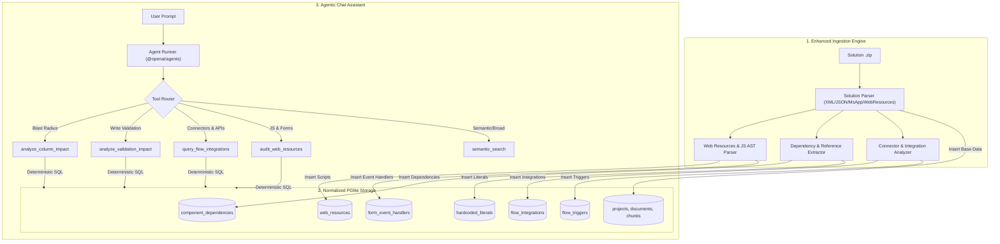

# Implementation Plan: Inverted Dependency Graph & Web Resources in PGlite

## Executive Summary
This plan details the end-to-end implementation to enrich **pp-pedia** with structural analysis, Web Resource extraction (JavaScript, HTML, CSS), and an inverted dependency graph stored directly in **PGlite** (IndexedDB). 

By persisting relational dependencies alongside vectors and markdown, the **Agentic Chat Assistant** can execute sub-millisecond, 100% deterministic SQL queries to answer complex architectural questions:
1. **Connector & API Discovery**: *"What are the flows that use Power BI or premium connectors?"*
2. **Blast Radius / Impact Analysis**: *"What is the impact of deleting a column?"*
3. **Write-Path Contract Breaches**: *"What is the impact of adding a validation or making a field required?"*
4. **Client-Side Scripts & Form Auditing**: *"Which JavaScript web resources run OnSave/OnChange, or use deprecated `Xrm.Page` APIs?"*
5. **Portability & ALM Readiness**: *"Are there hardcoded GUIDs or test tenant URLs in flows, apps, or scripts?"*

---

## Architecture Overview



---

## Phase 1: Type Definitions & Solution AST Extensions

### Target Files:
* [`client/src/types/solution.ts`](file:///home/spadmin/repos/pp-pedia/client/src/types/solution.ts)
* [`client/src/types/db.ts`](file:///home/spadmin/repos/pp-pedia/client/src/types/db.ts)

### Implementation Tasks:
1. **Define Web Resource Models**:
   ```typescript
   export type WebResourceType =
     | 'HTML'
     | 'CSS'
     | 'JavaScript'
     | 'XML'
     | 'PNG'
     | 'JPG'
     | 'GIF'
     | 'XAP'
     | 'XSL'
     | 'ICO'
     | 'SVG'
     | 'RESX'
     | 'Unknown';

   export interface WebResource {
     id: string;
     name: string;
     display_name?: string;
     description?: string;
     type: WebResourceType;
     type_code: number;
     file_path?: string;
     content_text?: string;
     file_size_bytes: number;
     detected_functions?: string[];
     uses_deprecated_xrm?: boolean;
     uses_direct_dom?: boolean;
   }
   ```

2. **Define Form Event Handler Models**:
   ```typescript
   export interface FormEventHandler {
     id: string;
     entity_name: string;
     form_id?: string;
     form_name: string;
     event_type: 'OnLoad' | 'OnSave' | 'OnChange' | 'TabStateChange';
     target_field?: string;
     library_name: string;
     function_name: string;
     pass_execution_context: boolean;
     enabled: boolean;
   }
   ```

3. **Define Dependency & Integration Models**:
   ```typescript
   export interface ComponentDependency {
     id: string;
     source_type: 'flow' | 'canvas_app' | 'javascript' | 'relationship' | 'formula';
     source_id: string;
     source_name: string;
     location_detail?: string;
     target_entity: string;
     target_field?: string;
     operation_type: 'READ' | 'WRITE' | 'TRIGGER_FILTER' | 'LOOKUP' | 'DELETE';
     context_snippet?: string;
   }

   export interface FlowIntegration {
     id: string;
     flow_id: string;
     flow_name: string;
     connector_id: string;
     connector_name: string;
     operation_id?: string;
     action_name: string;
     is_premium: boolean;
   }

   export interface HardcodedLiteral {
     id: string;
     component_type: 'flow' | 'canvas_app' | 'javascript';
     component_name: string;
     literal_type: 'GUID' | 'URL' | 'EMAIL';
     value: string;
     code_context?: string;
   }
   ```

4. **Extend `SolutionAST` and `SolutionStats`**:
   * Add `web_resources: WebResource[]`
   * Add `form_event_handlers: FormEventHandler[]`
   * Add `dependencies: ComponentDependency[]`
   * Add `flow_integrations: FlowIntegration[]`
   * Add `hardcoded_literals: HardcodedLiteral[]`
   * Update stats with `web_resource_count`, `script_count`, `dependency_count`.

---

## Phase 2: Parser Expansion (Web Resources, JavaScript & AST Analyzers)

### Target Files:
* [`client/src/services/parser/solutionParser.ts`](file:///home/spadmin/repos/pp-pedia/client/src/services/parser/solutionParser.ts)
* Create `client/src/services/parser/jsAnalyzer.ts`
* Create `client/src/services/parser/dependencyExtractor.ts`

### Implementation Tasks:
1. **Parse `<WebResources>` & `<FormXml>` from `customizations.xml`**:
   * Extract all `<WebResource>` nodes mapping name, display name, and type code.
   * Extract form event handlers from `<Entities><Entity><form><formXml><events>` and `<formLibraries>`.
2. **Extract Files from Zip**:
   * Read matching files from `WebResources/` directory in the zip.
   * Decode text content for JS, HTML, CSS, XML, and RESX.
3. **JavaScript Static Code Analysis (`jsAnalyzer.ts`)**:
   * Detect function declarations (e.g. `function onLoad(context)`, `var FormScript = { onSave: ... }`).
   * Check for deprecated API usages: `Xrm.Page` (flagged for modernization).
   * Check for unsupported DOM methods: `document.getElementById`, `window.parent`.
   * Extract Dataverse column/attribute accesses:
     * `formContext.getAttribute("...")` $\rightarrow$ `READ`/`WRITE`
     * `formContext.getControl("...")` $\rightarrow$ `UI`
     * `Xrm.WebApi.createRecord("...")`, `Xrm.WebApi.updateRecord("...")` $\rightarrow$ `WRITE`
     * `Xrm.WebApi.retrieveRecord("...")`, `Xrm.WebApi.retrieveMultipleRecords("...")` $\rightarrow$ `READ`
   * Extract hardcoded endpoints (`https://...`, GUID regex patterns).
4. **Flow & Canvas App Dependency Extraction (`dependencyExtractor.ts`)**:
   * Analyze Cloud Flow actions for Dataverse steps (`OpenApiConnection` with Dataverse connector):
     * Detect target entity, operation (Create, Update, Delete, List).
     * Extract attributes assigned in the body payload $\rightarrow$ `WRITE` dependencies.
     * Extract trigger filter expressions and select columns $\rightarrow$ `TRIGGER_FILTER` dependencies.
     * Track connector IDs (`shared_powerbi`, `shared_commondataserviceforapps`, `shared_office365`, HTTP).
   * Analyze Canvas App formulas:
     * Extract `Patch(EntityName, ...)` and `SubmitForm(...)` $\rightarrow$ `WRITE` dependencies.
     * Extract `LookUp(...)`, `Filter(...)`, `Gallery.Selected.Column` $\rightarrow$ `READ` dependencies.

---

## Phase 3: PGlite Database Schema & Batch Persistence

### Target File:
* [`client/src/services/db.ts`](file:///home/spadmin/repos/pp-pedia/client/src/services/db.ts)

### Implementation Tasks:
1. **Schema DDL**:
   Add `CREATE TABLE IF NOT EXISTS` for:
   * `web_resources`
   * `form_event_handlers`
   * `component_dependencies`
   * `flow_integrations`
   * `flow_triggers`
   * `hardcoded_literals`
   * All with `FOREIGN KEY (project_id) REFERENCES projects(id) ON DELETE CASCADE`.
2. **Add Targeted Indexes**:
   * `idx_dependencies_target`: on `(target_entity, target_field)`
   * `idx_flow_integrations`: on `(project_id, connector_name)`
   * `idx_form_events`: on `(entity_name, target_field)`
   * `idx_webres_project`: on `(project_id, name)`
3. **Atomic Batch Ingestion**:
   * Update [`saveFullProjectIngestion`](file:///home/spadmin/repos/pp-pedia/client/src/services/db.ts#L456-L472) to insert all parsed dependencies, integrations, and web resources within the single transactional boundary (`SET LOCAL synchronous_commit = off;`).
4. **Relational Query Helpers**:
   * `queryComponentDependencies(projectId, entity, field?, operation?)`
   * `queryFlowIntegrations(projectId, connectorName?, isPremium?)`
   * `queryFormEventHandlers(projectId, entity, field?)`
   * `queryWebResources(projectId, options?)`
   * `queryHardcodedLiterals(projectId, type?)`

---

## Phase 4: Agent Tools & Agent Runner Integration

### Target Files:
* [`client/src/services/agent/agentTools.ts`](file:///home/spadmin/repos/pp-pedia/client/src/services/agent/agentTools.ts)
* [`client/src/services/agent/agentRunner.ts`](file:///home/spadmin/repos/pp-pedia/client/src/services/agent/agentRunner.ts)

### Implementation Tasks:
1. **Build Deterministic Agent Tools**:
   * **`analyze_column_impact`**:
     * Inputs: `entity_name`, `column_name`, optional `projectId`.
     * Queries `component_dependencies` for matching `target_entity` + `target_field`.
     * Queries `form_event_handlers` for `OnChange` handlers on that field.
     * Queries `entity_relationships_flat` for lookup foreign keys.
     * Returns a formatted breakdown: Affected Flows, Canvas App controls, JavaScript functions, and Dataverse relationships.
   * **`analyze_validation_impact`**:
     * Inputs: `entity_name`, `column_name`, `validation_type` (e.g. `'required'`, `'min_max'`).
     * Queries all `WRITE` operations on `target_entity`.
     * Compares payloads to check which Flows or Apps write without supplying this field.
   * **`query_flow_integrations`**:
     * Inputs: `connector_filter` (e.g. `'Power BI'`), `is_premium` (boolean).
     * Returns exact list of Cloud Flows, specific action names, and operations.
   * **`audit_web_resources`**:
     * Inputs: `audit_type` (`'deprecated_xrm'`, `'dom_manipulation'`, `'list'`, `'event_handlers'`).
     * Returns scripts requiring refactoring or modernizing for Unified Interface.
   * **`audit_hardcoded_literals`**:
     * Inputs: `literal_type` (`'GUID'`, `'URL'`, `'ALL'`).
     * Returns hardcoded values that should be moved to Environment Variables.
2. **Update Agent System Instructions**:
   * Guide the agent to route blast-radius questions directly to `analyze_column_impact` and connector inquiries to `query_flow_integrations` before falling back to broad text search.

---

## Phase 5: UI & Dashboard Enhancements

### Target Files:
* [`client/src/components/dashboard/SolutionCard.tsx`](file:///home/spadmin/repos/pp-pedia/client/src/components/dashboard)
* [`client/src/services/generator/docGenerator.ts`](file:///home/spadmin/repos/pp-pedia/client/src/services/generator/docGenerator.ts)
* [`client/src/services/exporter.ts`](file:///home/spadmin/repos/pp-pedia/client/src/services/exporter.ts)

### Implementation Tasks:
1. **Dashboard Badges**: Show Web Resources and Scripts count alongside Entities and Flows.
2. **Documentation Suite Generator**: Add an automated documentation task for **Web Resources & Client Scripting**, detailing registered form events and modernization health.
3. **ZIP Exporter**: Include the `web_resources/` folder in the generated documentation export bundle.

---

## Verification & Acceptance Criteria

| Capability | Verification Test | Expected Outcome |
| :--- | :--- | :--- |
| **Connector Discovery** | Ask: *"What are the flows that use Power BI?"* | Instant (<100ms) exact list of flows and action names from `flow_integrations`. |
| **Column Blast Radius** | Ask: *"What would be the impact of deleting a column?"* | Comprehensive list covering Cloud Flow actions, Canvas App formulas, and JavaScript `formContext.getAttribute` calls. |
| **Validation Contract Breach** | Ask: *"Impact of adding a validation in a field?"* | Identifies all Flows and Canvas Apps that write (`Patch` / `CreateRecord`) to that entity. |
| **Web Resource Extraction** | Ingest solution with JS scripts | All `.js` files parsed, functions indexed in `web_resources`, and form events in `form_event_handlers`. |
| **Modernization Audit** | Ask: *"Are any scripts using deprecated Xrm.Page?"* | Lists all scripts and line contexts calling `Xrm.Page`. |
